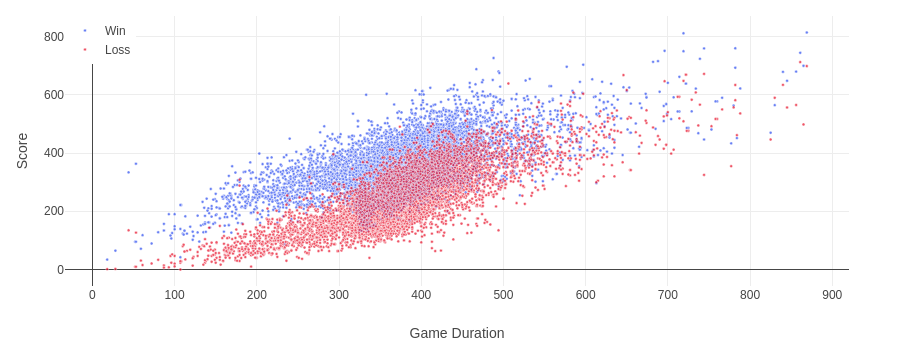
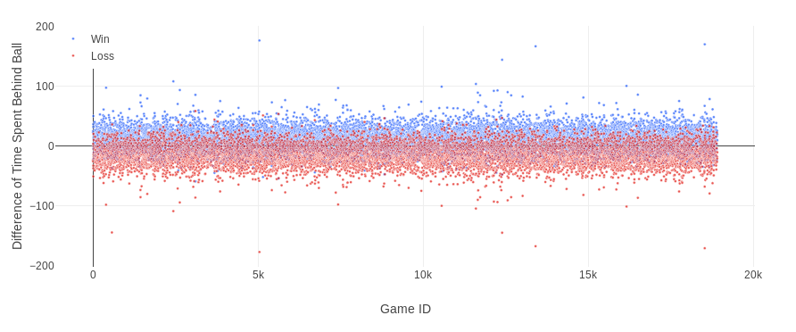
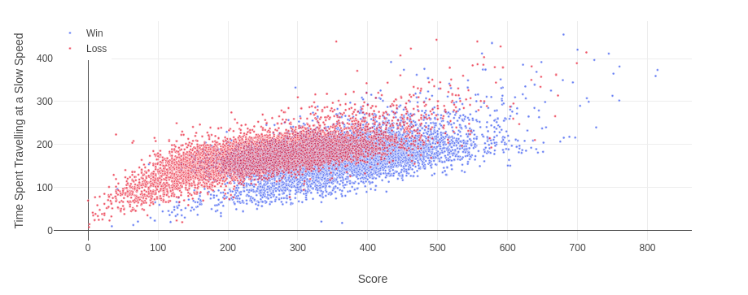
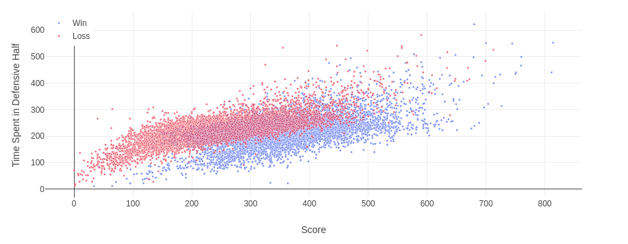
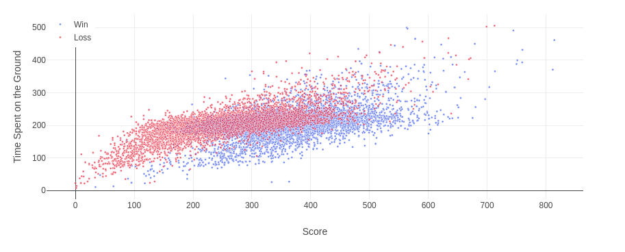

# Rocket League Analysis and Predictions

## __A quick overview__
Rocket League is a video game with many similarities to hockey or soccer. The goal is for a 3 man team to get the ball into the opponents goal more times than the opponent can score on them. My goal was to find out what measurable components of a team's style of play contribute to the chance of that team winning the game, if there were any at all.

---
## __File Structure__

The file structure is straight forward for this project. My goal was to make it easy for anyone to decide to look through it and make their own changes. Each major component is split into it's own folder, with the exception of a few of the saved HDF5 files. I apologize if there are any errors from pandas when trying to read a file, I moved a few files around to make things more tidy and may not have caught them all.

---
## __The Data__

All of the data used for this project was scraped from the website _ballchasing.com_ (a website for players to upload replays of games of analysis) using the filter to only get matches in the 3 vs 3 format withing the Champion ranks. This was done to ensure that the data represented a level of play that depends more on tactics than just pure skill, while still having a larger number of game entries than the rank of Grand Champion. Games were then combined into team stats by taking the average of each statistic value for the respective team. I then created new columns for the difference between teams for each stat for easier in-game comparison so that I wouldn't just take sample values into account when game-to-game situations change.

After some cleaning and running a few machine learning algorithms, I made a dataset of the most important values in regards to predicting a win of loss.

The most important values include:

- Difference of time spent behind the ball
- Saves
- Time spent in front of the ball
- Time spent in own defensive half
- Time spent of the ground
- Total distance travelled
- Time spent low in the air
- Difference of time spent in the neutral third of the field
- Difference of average distance to the ball while having possession
- Time spent travelling at a slow speed
- Average distance to the ball while not having possession
- Difference of total distance travelled
- Difference in amount of boost collected
- Total time spent behind the ball

---
## __Findings__

As for how this data translates to gameplay, I tried to find things that effect the outcome while still being variable the player can change with practice. Below are a few charts with explanations as to how they can help a team's play.

For all of the graphics, a blue dot indicates a win while a red dot indicates a loss.

### **Score by Game Duration**

  

This chart is shown solely to point out the obvious correlation between a team's score and whether or not they won the game (score does not indicate a win, but it's a good guess). This will be used to help show other correlations later on.

### **Difference of Time Spent behind the Ball**

  

To me this is a very telling graph. This is a clear positive correlation based on how long a team spends behind the ball. In context I can only assume that means a more controlled style of play tends to win. Where a team either keeps the ball in their possession or in position to stop the other team by staying in front of them (in a relative sense).

### **Time Spent Travelling at a Slow Speed**

  

As score increase one can noticed that there is a trend of losses at every score level having a higher amount of time spent travelling at a slow pace (non-boosted). It can also be seen that slow team tend to have a lower chance for getting high scorelines as well, also indicating a higher chance of losing. 

### **Time Spent in Own Defensive Half**

  

This kind of goes along with the last chart. The longer you spend on defense, in general a team has a higher chance of losing the game. I say this is connected to speed because when a team is on defense they tend to get "boost starved", lowering their chances at reaching higher speeds to break out of their half.

### **Time Spent on the Ground**

  

The final point I'd like to show is that spending time on the ground has an adverse effect in winning games. What this means to me is that you should be getting off the ground and challenging the ball quickly to ensure more offensive opportunities for your team.

## __Main Take-Aways__

Based off the information above, I would say that to increase the likelihood of winning in every game boils down to a few simple ideas:

1. Play in control - Keep the ball in front of you whenever you can so that the defense is within your vision, this also allows for passes to teammates where they are in better position for a shot.
2. Play fast - When I say this, I don't mean play like a maniac and go for everything. The ball should still stay in possession, but meet the ball in the field instead of letting it come to you. Doing this will not only help keep offensive pressure, it will allow you breathing room on defense.
3. Get off the ground quick - Don't go for high balls with low boost, but you should never hesitate when you decide to go for a ball. Hesitating loses games.